<div align="center">

<br/>

<a href="https://github.com/Santosh02411?tab=followers"></a>
<a href="mailto:santoshmadannavar@gmail.com"></a>
</div>

---


### 🧑‍💻 About Me

```python
class Santosh:
    def __init__(self):
        self.name     = "Santosh Suresh Madannavar"
        self.role     = "CSE Graduate @ MMEC Belagavi (2026)"
        self.passion  = ["AI/ML", "Generative AI", "Agentic Systems", "Real-world Problem Solving"]
        self.stack    = ["Python", "Flask", "Django", "React", "XGBoost", "scikit-learn", "LangChain"]
        self.focus    = "Applied GenAI, ML Pipelines & Full-Stack Systems"
        self.location = "Belagavi, Karnataka 🇮🇳"
        self.email    = "santoshmadannavar@gmail.com"

    def motto(self):
        return "Code. Learn. Repeat. 🚀"
```

- 🎓 **B.E. CSE Graduate** — Maratha Mandal's Engineering College, Belagavi (CGPA: 8.67/10)
- 💼 Data Science Intern @ **EchoBrains Technologies** — built end-to-end ML pipelines & deployed them as Flask REST APIs
- 🤖 AI Fellow — **VTU Bharat Unnati (TechLeap) Program**, recognized as a **top fellow** for Generative AI & Agentic workflow delivery
- 🔍 Applied hands-on with **LangChain, RAG, and LLM-powered agentic applications**
- 🌐 Full-stack deployments via **Flask, Django & React** — I ship products, not just notebooks
- 💬 Ask me about: **ML pipelines, RAG/LangChain, Flask APIs, Web development ,Full-Stack Development**
<br clear="right"/>

## 🔨 Currently Working On

<div align="center">

### 📦 [Delivery_Sync](https://github.com/Santosh02411/Delivery_Sync) — Offline-First Delivery Status Sync

**The problem:** Delivery updates fail the moment a rider loses signal in a low-network area — status changes get lost instead of just delayed.

**What I'm building:** An offline-first app that queues status updates locally and syncs them the moment connectivity returns, with conflict resolution for updates made while offline.


🚧 **Status:** In active development — building the offline sync & conflict-resolution logic

</div>

---

## 💼 Experience

<table>
<tr>
<td width="50%" valign="top">

**Data Science Intern**
*EchoBrains Technologies Pvt. Ltd.* — Bengaluru
`Feb 2026 – May 2026`

- Engineered 3 end-to-end ML pipelines (ingestion → feature engineering → training → deployment)
- Achieved a **15% accuracy improvement** via hyperparameter tuning & cross-validation
- Deployed models as production-ready **Flask REST APIs** for real-time inference
- Built dashboards with **Matplotlib/Seaborn** to surface business insights

</td>
<td width="50%" valign="top">

**Artificial Intelligence Fellow**
*LearnersByte / ExpertPedia — Bharat Unnati TechLeap Program (VTU)*
`2025 – 2026`

- Selected for a competitive **4-month applied AI fellowship**, one of a limited cohort
- Built context-aware, multi-step **agentic applications** using **LangChain, RAG & LLM APIs**
- Recognized as a **top fellow** for technical delivery & professional conduct

</td>
</tr>
</table>

---

## 🚀 Major Projects

<details open>
<summary><b>❄️ Cold Weather EV Range Degradation Modeler</b></summary>
<br>

> End-to-end ML web app predicting EV battery range degradation in cold weather, achieving **90%+ model accuracy**.

**Key Features**
- XGBoost regression with extensive feature engineering on climate + telemetry datasets
- SHAP-based explainability — shows *which* factors (temperature, wind chill, battery age) drive the predicted range loss
- Flask REST API backend with a responsive HTML/CSS/JS frontend for real-time inference

| | |
|---|---|
| 🔗 **Repo** | [cold_weather_EV_range_degradation](https://github.com/Santosh02411/cold_weather_EV_range_degradation) |
| 🧠 **ML** | XGBoost, Scikit-learn, SHAP Explainability |
| 🌐 **Web** | Python, Flask, HTML/CSS/JS |
| 📦 **Data** | Pandas, NumPy |

</details>

<details>
<summary><b>📢 Unified Social Media Ads Platform</b></summary>
<br>

> Multi-platform advertising dashboard supporting ad creation, publishing & scheduling across 6 platforms from a single interface.

**Key Features**
- OAuth 2.0 authentication + 6 integrated third-party REST APIs for cross-platform campaign management
- Modular Flask backend with SQLite persistence, designed for easy extensibility to new platforms
- Central scheduling engine to cut manual ad-management overhead

| | |
|---|---|
| 🔗 **Repo** | [social-media-ads-platform](https://github.com/Santosh02411/social-media-ads-platform) |
| 🔑 **Auth** | OAuth 2.0, REST APIs |
| 🌐 **Stack** | Python, Flask, HTML/CSS/JS |
| 🗄️ **DB** | SQLite |

</details>

<details>
<summary><b>🛡️ Malware Detection Using Machine Learning</b></summary>
<br>

> Cybersecurity ML pipeline for detecting & classifying malware, achieving high-precision threat identification.

**Key Features**
- XGBoost & Random Forest ensemble trained on real-world security datasets
- SHAP-based Explainable AI for actionable threat-cause analysis
- Deployed as a Flask web app with a file-upload interface for real-time scanning

| | |
|---|---|
| 🔗 **Repo** | [Malware-detection](https://github.com/Santosh02411/Malware-detection) |
| 🧠 **ML** | XGBoost, Random Forest, Scikit-learn |
| 🔍 **XAI** | SHAP, Explainable AI |
| 🌐 **Web** | Flask, Pandas, NumPy |

</details>

<details>
<summary><b>🧮 Formula Forge — AI Problem Solver</b></summary>
<br>

> AI-powered web app solving math/science/engineering problems with detailed step-by-step solutions.

**Key Features**
- Google Gemini API integration for step-by-step reasoning, not just final answers
- Modern React + TypeScript frontend built with Vite
- Node.js backend handling prompt orchestration and response formatting

| | |
|---|---|
| 🔗 **Repo** | [Formula-Forge](https://github.com/Santosh02411/Formula-Forge) |
| 🤖 **AI** | Google Gemini API |
| ⚛️ **Frontend** | React, TypeScript, Vite |
| 🛠️ **Backend** | Node.js |

</details>

---

## 🌱 Mini Projects

| Project | Description | Tech |
|---|---|---|
| 🏥 [Quick Aid](https://github.com/Santosh02411/Quick-Aid) | An AI Medical Assistant for real-time injury detection via computer vision | Python, Flask, OpenCV, ML |
| 💳 [FraudGuard](https://github.com/Santosh02411/fraudguard) | Fraud detection system flagging suspicious transactions before approval | Python, Scikit-learn, Flask, SQLite |
| 🌱 [Krushi](https://github.com/Santosh02411/krushi) | AI platform for crop selection & farmer advisory using soil/climate data | Python, Flask, Scikit-learn, Pandas |

---

## 🛠️ Tech Stack & Tools

<div align="center">


<br/>


<br/><br/>


<br/>


<br/><br/>


<br/>


<br/><br/>


<br/>


<br/><br/>


<br/>


</div>

---

## 🎓 Certifications

- **Getting Started with Artificial Intelligence** — IBM SkillsBuild
- **Retrieval Augmented Generation with LangChain** — Adobe Learning Manager
- **Machine Learning SkillUp** — Simplilearn
- **The Ultimate Job Ready Data Science Course** — CodeWithHarry
- **Journey to Cloud: Envisioning Your Solution** — IBM SkillsBuild

---
## 📊 GitHub Stats

<div align="center">


</div>

<div align="center">

</div>


<details>
<summary align="center"><b>📅 last few months Activity — click to expand</b></summary>
<br/>

<div align="center">

</div>

</details>


<!--
🐍 Bonus (real animated motion): a moving contribution "snake"
Add the provided snake.yml to .github/workflows/, let it run once, then uncomment:
<div align="center"></div>
-->

<div align="center">

</div>

## 📫 Let's Connect!

<div align="center">

<a href="https://www.linkedin.com/in/santosh-madannavar-3ba5a7261/"></a> [](https://www.linkedin.com/in/santosh-madannavar-3ba5a7261/)

<a href="https://github.com/Santosh02411"></a>[](https://github.com/Santosh02411)

<a href="mailto:santoshmadannavar@gmail.com"></a> [](mailto:santoshmadannavar@gmail.com)

</div>


